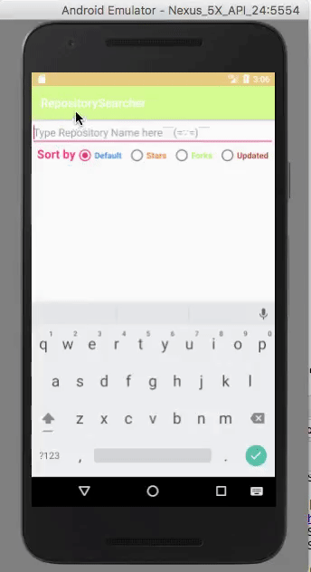

# RepositorySearcher

## Description

サーチボックスに検索したいレポジトリ名を打ち込むと、
一行目にレポジトリ名、二行目にDescriptionが表示される。
検索結果のリストは各々Default, Stars, Folks, Updatedで
ソートすることができる。

## Demo

## Twists（工夫点）

URLの発行を一行にまとめて、クエリや検索パラメータが変化した際にも
柔軟に対応できるようにした。

## Author 
moetomato
